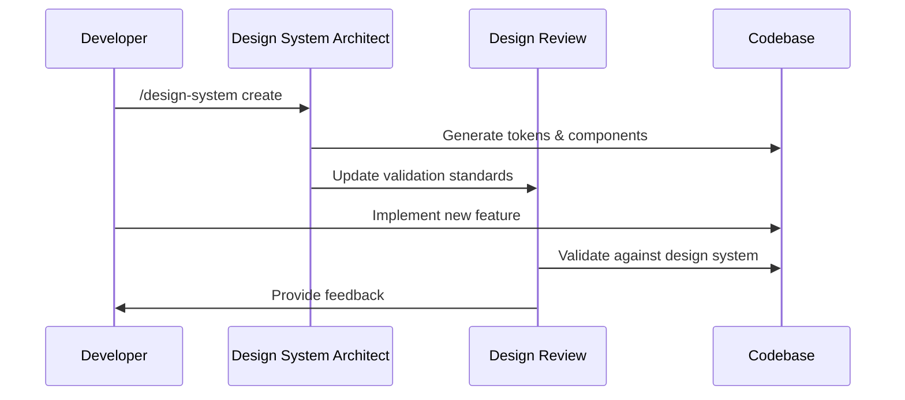
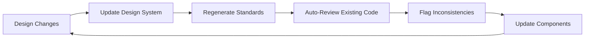
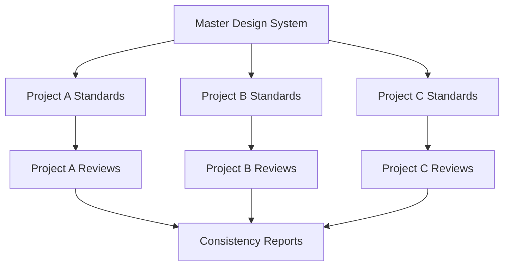

# Integration Guide: Design System Architect + Design Review

This guide explains how to integrate the Design System Architect workflow with the existing design-review workflow for automated design system creation and validation.

## Overview

The integration creates a powerful cycle:
1. **Design System Architect** creates comprehensive design standards
2. **Design Review Workflow** validates implementations against those standards
3. **Continuous Improvement** through automated feedback and iteration

## Setup Process

### Step 1: Install Both Workflows

```bash
# Clone the claude-code-workflows repository
git clone https://github.com/OneRedOak/claude-code-workflows.git

# Copy workflows to your Claude Code directory
cp -r claude-code-workflows/design-review ~/.claude/workflows/
cp -r claude-code-workflows/design-system-architect ~/.claude/workflows/

# Or install directly via Claude Code
claude workflow install OneRedOak/claude-code-workflows/design-review
claude workflow install OneRedOak/claude-code-workflows/design-system-architect
```

### Step 2: Project Configuration

Create a `.claude/project.json` configuration:

```json
{
  "workflows": {
    "design-system-architect": {
      "enabled": true,
      "autoTriggers": ["design-assets/**", "brand-guidelines/**"],
      "outputPath": "./design-system/",
      "integration": {
        "designReview": true,
        "updateCLAUDE": true
      }
    },
    "design-review": {
      "enabled": true,
      "autoTriggers": ["src/**/*.tsx", "src/**/*.css"],
      "standardsPath": "./design-system/",
      "validateAgainst": "design-system-tokens"
    }
  }
}
```

### Step 3: Initial Design System Creation

```bash
# Analyze existing codebase and create initial design system
/design-system audit --source="./src/" --output="./design-audit.md"
/design-system create --brand-guide="./assets/" --framework="react" --output="./design-system/"
```

This generates the foundation that design reviews will validate against.

## Workflow Integration Patterns

### Pattern 1: Creation → Validation Cycle



### Pattern 2: Continuous Evolution



### Pattern 3: Multi-Project Consistency



## CLAUDE.md Integration

Both workflows automatically maintain your CLAUDE.md file:

```markdown
# Design System & Review Standards

## Design System (Generated by @design-system-architect)
This project uses an automated design system with the following structure:

### Design Tokens
- **Colors**: `./design-system/tokens/colors.ts` - Brand colors with accessibility compliance
- **Typography**: `./design-system/tokens/typography.ts` - Font scales and families
- **Spacing**: `./design-system/tokens/spacing.ts` - Consistent spacing system
- **Shadows**: `./design-system/tokens/shadows.ts` - Elevation and depth system

### Component Library
- **Location**: `./design-system/components/`
- **Documentation**: `./design-system/docs/`
- **Storybook**: `./storybook/` (if enabled)

### Style Guide
- **Guidelines**: `./design-system/docs/style-guide.md`
- **Usage Examples**: `./design-system/examples/`
- **Brand Standards**: `./design-system/brand/`

## Design Review Standards (Validated by @design-review)

### Automated Validation Criteria
1. **Color Usage**: All colors must reference design tokens from `./design-system/tokens/colors.ts`
2. **Typography**: Font sizes and families must use defined scales
3. **Spacing**: Margins and padding must use spacing tokens
4. **Component Structure**: Components must follow established patterns
5. **Accessibility**: WCAG AA compliance required for all interactive elements

### Review Triggers
- Pre-commit: Validate all component changes
- Pull Request: Comprehensive design review
- Manual: `/design-review --comprehensive`

### Integration Points
The design-review workflow validates against standards created by design-system-architect:
- Design tokens serve as validation criteria
- Component specs define expected patterns
- Style guide provides context for review feedback
- Documentation ensures consistent interpretation

## Workflow Commands

### Design System Management
- `/design-system create` - Generate new design system
- `/design-system update` - Refresh existing system
- `/design-system audit` - Analyze current state
- `/design-system sync` - Synchronize with design tools

### Design Review
- `/design-review` - Review current changes
- `/design-review --comprehensive` - Full codebase review
- `/design-review --component=ComponentName` - Review specific component

### Combined Operations
- `/design-review --update-standards` - Update design system and re-review
- `/design-system create --with-review` - Create system and immediate validation
```

## Automation Setup

### Git Hooks Integration

Create `.husky/pre-commit`:
```bash
#!/bin/sh
. "$(dirname "$0")/_/husky.sh"

# Update design system if brand assets changed
if git diff --cached --name-only | grep -E "(brand|assets|design)/" ; then
  claude /design-system update --quick
fi

# Run design review on component changes
if git diff --cached --name-only | grep -E "src/.*\.(tsx|css|scss)$" ; then
  claude /design-review --staged
fi
```

### CI/CD Integration

Add to your GitHub Actions workflow:
```yaml
name: Design System Validation
on: [pull_request]

jobs:
  design-review:
    runs-on: ubuntu-latest
    steps:
      - uses: actions/checkout@v3
      - name: Setup Claude Code
        uses: anthropic/claude-code-action@v1
      - name: Update Design System
        run: claude /design-system update --ci
      - name: Run Design Review
        run: claude /design-review --pr --format=github-comment
```

### IDE Integration

For VS Code, create `.vscode/tasks.json`:
```json
{
  "version": "2.0.0",
  "tasks": [
    {
      "label": "Update Design System",
      "type": "shell",
      "command": "claude",
      "args": ["/design-system", "update", "--watch"],
      "group": "build",
      "isBackground": true
    },
    {
      "label": "Design Review Current File",
      "type": "shell",
      "command": "claude",
      "args": ["/design-review", "--file=${file}"],
      "group": "test"
    }
  ]
}
```

## Advanced Integration Scenarios

### Multi-Brand Systems

For organizations with multiple brands:

```bash
# Create master design system
/design-system create --multi-brand --master --output="./design-systems/master/"

# Create brand-specific systems that inherit from master
/design-system create --extend="./design-systems/master/" --brand="BrandA" --output="./design-systems/brand-a/"
/design-system create --extend="./design-systems/master/" --brand="BrandB" --output="./design-systems/brand-b/"

# Configure review to validate against appropriate brand
/design-review --standards="./design-systems/brand-a/" --project="brand-a-website"
```

### Design Tool Synchronization

Integrate with design tools for automatic updates:

```bash
# Figma integration
/design-system sync --figma-file="https://figma.com/file/abc123" --auto-update

# Sketch integration  
/design-system sync --sketch-file="./designs/components.sketch" --watch

# Adobe XD integration
/design-system sync --xd-file="./designs/design-system.xd" --export-tokens
```

### Performance Monitoring

Track design system impact:

```javascript
// Monitor design system usage
const designSystemMetrics = {
  tokenUsage: '95%', // Percentage of hardcoded values replaced with tokens
  componentReuse: '87%', // Components using design system patterns
  consistencyScore: '94%', // Automated consistency measurement
  accessibilityCompliance: '100%', // WCAG compliance rate
  bundleImpact: '-23%' // CSS bundle size reduction
};

// Integrate with analytics
window.dataLayer.push({
  event: 'design_system_metrics',
  ...designSystemMetrics
});
```

## Troubleshooting

### Common Integration Issues

**Issue**: Design review fails after design system update
**Solution**: 
```bash
/design-system update --force-regenerate
/design-review --update-cache --re-validate
```

**Issue**: Inconsistent validation between local and CI
**Solution**: Ensure same Claude Code version and workflow versions:
```bash
claude version
claude workflow list --with-versions
```

**Issue**: Design tokens not updating in components
**Solution**: Clear cache and regenerate:
```bash
/design-system clear-cache
/design-system update --full-regeneration
```

### Performance Optimization

For large codebases:
```bash
# Use incremental updates
/design-system update --incremental --changed-files-only

# Parallel processing for reviews
/design-review --parallel --max-workers=4

# Cache frequently used patterns
/design-system optimize --enable-caching --cache-duration=24h
```

## Best Practices

### 1. Start Small, Scale Up
- Begin with core tokens (colors, typography, spacing)
- Add components gradually
- Expand to full system over time

### 2. Maintain Consistency
- Use design system architect for all design changes
- Let design review validate all implementations
- Never bypass the workflow for "quick fixes"

### 3. Document Everything
- Keep design decisions in version control
- Maintain changelog for design system updates
- Document any custom overrides or exceptions

### 4. Monitor and Iterate
- Track design system adoption metrics
- Gather developer feedback regularly
- Evolve system based on real usage patterns

### 5. Team Training
- Onboard developers to both workflows
- Create training materials and examples
- Establish clear escalation paths for edge cases

This integration creates a powerful, automated approach to design system management that ensures consistency, accessibility, and quality across all your projects.