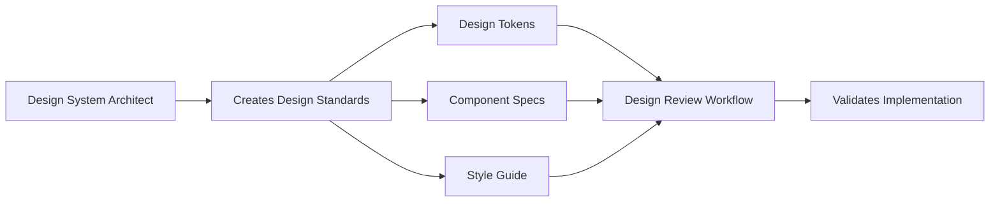

# Design System Architect Workflow Commands

This document defines the slash commands and workflow triggers for the Design System Architect agent.

## Slash Commands

### `/design-system create`
Creates a comprehensive design system from scratch.

**Usage:**
```bash
/design-system create --brand-guide="./assets/brand-guide.pdf" --framework="react" --output="./design-system/"
```

**Parameters:**
- `--brand-guide`: Path to brand guidelines or design assets
- `--framework`: Target framework (react, vue, angular, vanilla)
- `--output`: Output directory for generated design system
- `--style`: Styling approach (tailwind, css-modules, styled-components, scss)

**Process:**
1. Analyze brand assets and existing components
2. Generate comprehensive design tokens
3. Create component specifications
4. Generate implementation code
5. Create style guide documentation

### `/design-system tokens`
Generates design tokens from existing design assets.

**Usage:**
```bash
/design-system tokens --input="./designs/" --format="json,css,scss" --output="./tokens/"
```

**Parameters:**
- `--input`: Directory containing design files or asset exports
- `--format`: Output formats (json, css, scss, ts, yaml)
- `--output`: Directory for generated token files
- `--naming`: Naming convention (camelCase, kebab-case, snake_case)

### `/design-system components`
Creates component specifications and implementations.

**Usage:**
```bash
/design-system components --designs="./figma-exports/" --framework="react" --output="./src/components/"
```

**Parameters:**
- `--designs`: Path to component designs or specifications
- `--framework`: Implementation framework
- `--output`: Component output directory
- `--storybook`: Generate Storybook stories (true/false)

### `/design-system audit`
Analyzes existing codebase and identifies design system opportunities.

**Usage:**
```bash
/design-system audit --source="./src/" --output="./audit-report.md"
```

**Parameters:**
- `--source`: Source code directory to analyze
- `--output`: Audit report output file
- `--format`: Report format (markdown, html, json)

### `/design-system docs`
Generates comprehensive design system documentation.

**Usage:**
```bash
/design-system docs --input="./design-system/" --output="./docs/" --website
```

**Parameters:**
- `--input`: Design system source directory
- `--output`: Documentation output directory
- `--website`: Generate interactive website (flag)
- `--template`: Documentation template (default, minimal, enterprise)

## Workflow Integration

### Integration with Design Review
The Design System Architect workflow creates the standards that the design-review workflow validates:



### CLAUDE.md Integration
The workflow automatically updates your project's CLAUDE.md file with design system references:

```markdown
# Design System Standards

This project uses an automated design system created by the Design System Architect workflow.

## Design Tokens Location
- Colors: `./tokens/colors.json`
- Typography: `./tokens/typography.json`
- Spacing: `./tokens/spacing.json`

## Component Library
- Source: `./src/components/design-system/`
- Storybook: `./storybook/`
- Documentation: `./design-system-docs/`

## Style Guide
- Guidelines: `./docs/style-guide.md`
- Component Usage: `./docs/components/`
```

### Git Hooks Integration
Automatically trigger design system updates on relevant file changes:

```json
{
  "husky": {
    "hooks": {
      "pre-commit": "claude /design-system audit --source=./src/ && claude @design-review"
    }
  }
}
```

## Advanced Workflows

### Multi-Brand System
```bash
/design-system create --multi-brand --brands="brand-a,brand-b,brand-c" --shared-tokens="./shared-tokens/"
```

### Design Migration
```bash
/design-system migrate --from="./legacy-css/" --to="design-system" --framework="react"
```

### Component Library Update
```bash
/design-system sync --figma-file="https://figma.com/file/abc123" --components="Button,Input,Card"
```

## Configuration File

Create a `.claude/design-system.config.json` file to set defaults:

```json
{
  "defaultFramework": "react",
  "stylingApproach": "tailwind",
  "outputDirectory": "./design-system/",
  "generateStorybook": true,
  "accessibilityLevel": "WCAG-AA",
  "namingConvention": "camelCase",
  "tokenFormats": ["json", "css", "ts"],
  "integrations": {
    "designReview": true,
    "storybook": true,
    "figma": {
      "autoSync": false,
      "fileId": null
    }
  }
}
```

## Output Structure

The workflow generates this directory structure:

```
design-system/
├── tokens/
│   ├── colors.json
│   ├── typography.json
│   ├── spacing.json
│   └── index.ts
├── components/
│   ├── Button/
│   │   ├── Button.tsx
│   │   ├── Button.stories.tsx
│   │   └── Button.md
│   └── index.ts
├── styles/
│   ├── globals.css
│   ├── tokens.css
│   └── utilities.css
├── docs/
│   ├── style-guide.md
│   ├── getting-started.md
│   └── components/
└── website/
    ├── index.html
    ├── components.html
    └── tokens.html
```

## Quality Assurance

Every generated design system includes:

- **Accessibility Testing**: WCAG 2.1 AA compliance verification
- **Cross-Browser Testing**: Support matrix and compatibility checks
- **Performance Metrics**: Bundle size analysis and optimization recommendations
- **Design-Review Integration**: Automatic validation against created standards

## Error Handling

The workflow includes comprehensive error handling:

- **Invalid Brand Assets**: Clear messaging about required file formats
- **Framework Compatibility**: Warnings about unsupported combinations
- **Missing Dependencies**: Automatic installation prompts
- **Validation Failures**: Detailed reports with fix recommendations